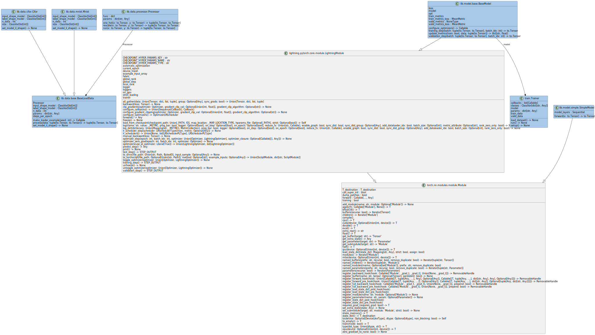

<!-- ============================================================
  Project Image
 ============================================================ -->
<!-- <div align=center>
  
</div> -->

<!-- ============================================================
  Overview
 ============================================================ -->

# :book:Overview

[](./README.md)
[](./README_JA.md)
[](./LICENSE)
[](https://mypy-lang.org/)
[](https://github.com/astral-sh/ruff)
[](https://github.com/astral-sh/uv)

[](https://github.com/python)
[](https://github.com/sphinx-doc/sphinx)
[](https://github.com/pytest-dev/pytest)
[](https://github.com/pydantic/pydantic)
[](https://github.com/numpy/numpy)
[](https://github.com/pandas-dev/pandas)
[](https://github.com/scipy/scipy)
[](https://github.com/scikit-learn/scikit-learn)
[](https://github.com/pytorch/pytorch)
[](https://github.com/Lightning-AI/pytorch-lightning)

This repository defines pytorch templates.

By using a parameter file to set the following items, you can train and evaluate in various combinations.
You can also easily use other settings by implementing them in your own settings classes.

- data (and data preprocess)
- model (and model layer)
- optimizer method
- loss function
- metrics
- callbacks

We use Sphinx to create documentation for the implementation sources.

Please clone this repository and check it locally.

For more details about the build, please see [here](docs/sphinx_docs.md).

```bash
cd pytorch-template/docs
make html -e SPHINXOPTS='-a -E -D language="en"' # "en" or "ja"
```

<!-- ============================================================
  Features
 ============================================================ -->
<!-- ## :desktop_computer:Features -->

<!-- ============================================================
  Usage
 ============================================================ -->

## :keyboard:Usage

### Install

```bash
git clone https://github.com/r-dev95/pytorch-template.git
```

### Build virtual environment

We assume that `uv` is installed.

If you do not yet have a Python development environment, please see [here][python].

[python]: https://github.com/r-dev95/env-python

```bash
cd pytorch-template
uv sync
```

### Download data and make shard-form data (webdataset)

```bash
cd src
uv run python dataset.py --result dataset --data mnist
```

### Training the model

```bash
uv run python train.py --param param/tutorial/param_train.yaml
```

### Evaluate the model

```bash
uv run python eval.py --param param/tutorial/param_eval.yaml
```

## How to use parameter file

This section describes how to use parameter files (`.yaml`).

The parameter file is used in the following source code.
The following source code can use some command line arguments, but they can be overwritten in the parameter file, so it is assumed that all parameters are set in the parameter file.

- train.py
- eval.py

Some of the settings can not be set using parameter file. In particular, detailed settings for pytorch must be implemented by referring to the official pytorch website.

### Set the main parameters

Main parameters that are also implemented as command line arguments are set with zero indentation.

- The main parameters include `param`, but this is not set as it only works as a command line argument.

`train.py` and `eval.py` common settings example:

```yaml
# log handler (idx=0: stream handler, idx=1: file handler)
# (True: set handler, False: not set handler)
# type: list[bool, bool]
handler: [True, True]
# log level (idx=0: stream handler, idx=1: file handler)
# (DEBUG: 10, INFO: 20, WARNING: 30, ERROR: 40, CRITICAL: 50)
# type: list[int, int]
level: [10, 10]
# random seed
# type: int
seed: 0
# directory path (data save)
# type: str
result: result
# number of workers (data loader)
# type: int
num_workers: 4
```

only `train.py` settings example:

```yaml
# directory path (training data)
# type: str
train: data/mnist/train
# directory path (validation data)
# type: str | None
valid: data/mnist/test
# batch size (training data)
# type: int
train_batch: 32
# batch size (validation data)
# type: int | None
valid_batch: 1000
# shuffle size
# type: int | None
shuffle: null
# Number of epochs
# type: int
epochs: 2
```

only `eval.py` settings example:

```yaml
# directory path (evaluation data)
# type: str
eval: data/mnist/test
# batch size (training data)
# type: int
batch: 1000
```

### Set the `data` and `data preprocess` parameters

For currently available `data`, see the variable `func`'s key of the `SetupData` class [here](pytorch_template/lib/data/setup.py).

`data` settings example:

```yaml
data:
  kind: mnist
```

For currently available `data preprocess`, see the variable `func`'s key of the `Processor` class [here](pytorch_template/lib/data/processor.py).

- The `kind` of `data preprocess` is set as a list.

- If you set `one_hot` to `kind`, set `one_hot` setting as shown in the following example.
  The same applies to the subsequent parameters.

`data preprocess` settings example:

```yaml
process:
  kind: [one_hot, rescale]

  one_hot:
    num_classes: &num_classes 10

  rescale:
    scale: 0.00392156862745098
    offset: 0
```

### Set the `model` and `model layer` parameters

For currently available `model`, see the variable `func`'s key of the `SetupModel` class [here](pytorch_template/lib/model/setup.py).

`model` settings example:

```yaml
model:
  kind: simple
```

For currently available `model layer`, see the variable `func`'s key of the `SetupLayer` class [here](pytorch_template/lib/model/layer.py).

- The `kind` of `model layer` is set as a list.

- The value of `kind` can have "\_" + alphanumeric characters at the end.

`model layer` settings example:

```yaml
layer:
  kind: [flatten, linear_1, relu, linear_2]

  flatten:
    start_dim: 1
    end_dim: -1

  LINEAR: &LINEAR
    in_features: 0
    out_features: 0
    bias: true
  linear_1:
    <<: *LINEAR
    in_features: 784
    out_features: &out_1 100
  linear_2:
    <<: *LINEAR
    in_features: *out_1
    out_features: *num_classes

  relu:
    inplace: false
```

### Set the `optimizer method` parameters

For currently available `optimizer method`, see the variable `func`'s key of the `SetupOpt` class [here](pytorch_template/lib/optimizer/setup.py).

- The `optimizer method` parameter is only used in `train.py`.

`optimizer method` settings example:

```yaml
opt:
  kind: adam

  adam:
    lr: 0.001
    betas: [0.9, 0.999]
    eps: 0.00000001
    weight_decay: 0
    amsgrad: false
    foreach: null
    maximize: false
    capturable: false
    differentiable: false
    fused: null
```

### Set the `loss function` parameters

For currently available `loss function`, see the variable `func`'s key of the `SetupLoss` class [here](pytorch_template/lib/loss/setup.py).

`loss function` settings example:

```yaml
loss:
  kind: ce

  ce:
    weight: null
    ignore_index: -100
    reduction: mean
    label_smoothing: 0
```

### Set the `metrics` parameters

For currently available `metrics`, see the variable `func`'s key of the `SetupMetrics` class [here](pytorch_template/lib/metrics/setup.py).

- The `kind` of `metrics` is set as a list.

`metrics` settings example:

```yaml
metrics:
  kind: [mse, bacc]

  mse:
    squared: true
    num_outputs: 1

  bacc:
    threshold: 0.5
    multidim_average: global
    ignore_index: null
    validate_args: true
```

### Set the `callbacks` parameters

For currently available `callbacks`, see the variable `func`'s key of the `SetupCallbacks` class [here](pytorch_template/lib/callbacks/setup.py).

- The `callbacks` parameter is only used in `train.py`.

- The `kind` of `callbacks` is set as a list.

`callbacks` settings example:

```yaml
cb:
  kind: [ms, mcp]

  ms:
    max_depth: 3

  mcp:
    monitor: null
    verbose: false
    save_last: null
    save_top_k: -1
    save_weights_only: false
    mode: min
    auto_insert_metric_name: true
    every_n_train_steps: null
    train_time_interval: null
    every_n_epochs: 1
    save_on_train_epoch_end: null
    enable_version_counter: true
```

<!-- ============================================================
  Structure
 ============================================================ -->

## :bookmark_tabs:Structure

<div align=center>
  
</div>

<!-- ============================================================
  License
 ============================================================ -->

## :key:License

This repository is licensed under the [BSD 3-Clause](LICENSE).
